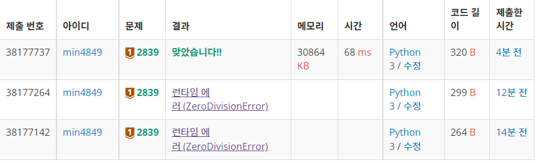

# bj 2839 설탕 배달

요구 : input 값을 5와 3의 덩어리가 최소가 되도록 나눠야 함.

1. 버린 코드

``` python
def delivery(inp):
    if inp ==0:
        return(-1)
    for times_5 in range(inp//5+1):
        for times_3 in range(inp//3+1):
            if inp%(5*(inp//5-times_5)+3*(inp//3-times_3))==0:
                return(inp//5-times_5+inp//3-times_3)
    return(-1)
inp=int(input())
print(delivery(inp))
```

답이 안나올 경우 -1을 반환하고 싶어서 함수를 만들었더니 런타임에러가 나왔다. ZeroDivisionError라던데.

2. 성공 코드

```python
inp = int(input())
total_times = 0
for times_5 in range(inp//5 +1):
    num3 = inp - 5*(inp//5-times_5)
    if num3%3 == 0:
        times_3 = num3 //3
        total_times = times_3 + inp//5-times_5
        if total_times == 0:
            break
        print(total_times)
        break
if total_times == 0:
    print(-1)
```

inp//5 - times_5 가 5kg 옮긴 횟수. 최대값부터 반복함.

inp//3 - times_3 가 3kg 옮긴 횟수. input에서 5 * (5kg 옮긴 횟수) 를 뺀 값이 3의 배수이면

옮긴 총 횟수 (total_times) 에  각 숫자 더해서 반환

옮긴 총 횟수가 0 인 경우 (정확하게 input이 안되는 경우, input이 0인 경우) -1 반환

