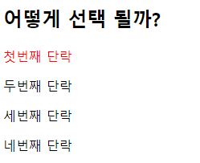
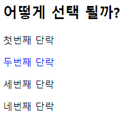

# Web 01. HTML & CSS workshop

1. \

2.  (a) : 상대경로, (b) : 절대경로, C:\Users\Windows10\Desktop\TIL\ssafy\image\my_photo.png

3.  \<a href="ssafy.com"> \ \</a>

4. 선택자

   1.  p:nth-child(2) : '첫번째 단락' 이 빨간색이 된다.

       

   2. p:nth-of-type(2) : '두번째 단락'이 파란색이 된다.

       

   3. nth-child()는 태그에 상관 없이 모든 자식 엘리먼트에 대해 적용된다.

       nth-of-type()는 특정 태그의 자식 엘리먼트에 대해 적용된다. 

